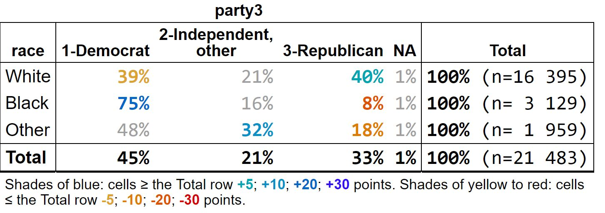

---
output:
  github_document:
    html_preview: false
always_allow_html: true
---

<!-- README.md is generated from README.Rmd. Please edit that file -->


# tabxplor

<!-- badges: start -->
[](https://CRAN.R-project.org/package=tabxplor)
[](https://github.com/BriceNocenti/tabxplor/actions/workflows/R-CMD-check.yaml)
[](https://app.codecov.io/gh/BriceNocenti/tabxplor)
<!-- badges: end -->

`tabxplor` makes cross-tables readable at a glance, for data exploration. One line of code builds a table with percentages, weighted counts, confidence intervals and tests — and **colors highlight the cells that stand out from the total, only when the difference is statistically solid**. You spot the structure of your data immediately, instead of scanning numbers row by row.

- **Colors encode effect size *and* significance** at once: the stronger the difference, the deeper the color; non-significant cells stay uncolored (or greyed). A black-and-white `theme = "print"` renders the same reading for journals.
- **Cells are rich values**: each one carries its count, percentage, confidence interval and reference behind the displayed number — tables are `tibble`s you can keep working on with `dplyr`.
- **The same colors follow you everywhere**: console, html, Excel, markdown/Quarto and plots.
- **Regression tables too**: `tab_reg()` presents logistic and other models with the same visual language, next to the observed percentages.
- Weighted and survey data are supported throughout, and a point-and-click [jamovi](https://www.jamovi.org/) module is available.



<style>
.p1,.p2,.p3,.p4,.m1,.m2,.m3,.m4{font-weight:bold;}
.tabxplor-tab,.tabxplor-tab table{border-collapse:collapse;border-top-width:0;border-bottom-width:0;margin:0;font-family:"DejaVu Sans Condensed","DejaVu Sans",Arial,helvetica,sans-serif;}
.tabxplor-caption{text-align:left;font-weight:bold;font-size:110%;white-space:normal;}
.tabxplor-tab tfoot{font-size:80%;text-align:left;}
.tabxplor-tab th,.tabxplor-tab td{padding:3px 4px;vertical-align:top;line-height:1.1;}
.tabxplor-tab table td,.tabxplor-tab table th{border-width:0;}
.tabxplor-tab table tbody tr:not(:has(td:not(:empty)))>*{border-top-style:solid;border-top-width:1px;padding:0;line-height:0;}
.tabxplor-tab table td:empty,.tabxplor-tab table th:empty{padding:0;}
.tabxplor-tab table tbody tr:has(td:not(:empty)) td:empty,.tabxplor-tab table thead tr:has(th:not(:empty)) th:empty{border-left-style:solid;border-left-width:1px;}
.tabxplor-tab table > thead > tr:first-child > *{border-top-style:solid;border-top-width:1px;}
.tabxplor-tab table > tbody > tr:last-child > *{border-bottom-style:solid;border-bottom-width:1px;}
.tabxplor-tab table > tbody > tr:has(td:not(:empty)) > *:last-child,.tabxplor-tab table > thead > tr > *:last-child{border-right-style:solid;border-right-width:1px;}
.tabxplor-tab table > tbody > tr:has(td:not(:empty)) > *:first-child,.tabxplor-tab table > thead > tr > *:first-child{border-left-style:solid;border-left-width:1px;}
.tabxplor-tab p{font-size:80%;}
.tabxplor-tab thead th{font-weight:bold;font-size:90%;text-align:center;vertical-align:bottom;line-height:1;border-top-width:0;border-bottom-style:solid;border-bottom-width:1px;}
.tabxplor-tab > thead > tr:first-child > *:not(.tx-span){border-top-style:solid;border-top-width:1px;}
.tabxplor-tab .tx-span{font-weight:bold;font-size:90%;text-align:center;border-bottom-style:solid;border-bottom-width:1px;}
.tabxplor-tab .tx-r{text-align:right;}
.tabxplor-tab .tx-l{text-align:left;}
.tabxplor-tab thead .tx-r,.tabxplor-tab thead .tx-l{text-align:center;}
.tabxplor-tab .tx-num{white-space:nowrap;}
.tabxplor-tab td.tx-num{font-family:"Cascadia Mono", "Cascadia Code", Menlo, Consolas, "DejaVu Sans Mono", monospace;font-size:1.1em;line-height:1;}
.tabxplor-tab .tx-br{border-right-style:solid;border-right-width:1px;}
.tabxplor-tab .tx-bl{border-left-style:solid;border-left-width:1px;}
.tabxplor-tab .tx-lbl{vertical-align:middle;text-align:center;}
.tabxplor-tab .tx-vname{writing-mode:vertical-rl;transform:rotate(180deg);white-space:normal;padding:4px 2px;}
.tabxplor-tab .tx-b,.tabxplor-tab tr.tx-b{font-weight:bold;}
.tabxplor-tab tr.tx-bt>*{border-top-style:solid;border-top-width:1px;}
.tabxplor-tab tr.tx-bb>*,.tabxplor-tab td.tx-bb{border-bottom-style:solid;border-bottom-width:1px;}
.tabxplor-tab tr.tx-bb2>*{border-bottom-style:solid;border-bottom-width:2px;}
.tabxplor-tab .tx-foot{width:0;min-width:100%;}
.tabxplor-tab .tx-pill{border-radius:4px;padding:1px 4px;}
.tooltip-inner{max-width:none;white-space:nowrap;}
.popover{max-width:none;}
.popover-body,.popover-content{padding:6px;white-space:nowrap;}
.tabxplor-tab{color:#000000;background:#ffffff;}
.tabxplor-tab th,.tabxplor-tab td{border-color:#000000;}
.tabxplor-tab tbody tr:hover{background:transparent;}
.g1,.tabxplor-tab .g1{color:#595959;}
.g2,.tabxplor-tab .g2{color:#111111;}
.tabxplor-caption{color:#000000;}
.p1,.tabxplor-tab .p1{color:#000000;}
.p2,.tabxplor-tab .p2{color:#000000;}
.p3,.tabxplor-tab .p3{color:#000000;text-decoration:underline;}
.p4,.tabxplor-tab .p4{color:#000000;text-decoration:underline;}
.m1,.tabxplor-tab .m1{color:#000000;font-weight:normal;font-style:italic;}
.m2,.tabxplor-tab .m2{color:#000000;font-weight:normal;font-style:italic;}
.m3,.tabxplor-tab .m3{color:#000000;font-weight:normal;font-style:italic;text-decoration:underline;}
.m4,.tabxplor-tab .m4{color:#000000;font-weight:normal;font-style:italic;text-decoration:underline;}
.o1,.tabxplor-tab .o1{background-color:#F5F5F5;}
.o2,.tabxplor-tab .o2{background-color:#E4E4E4;}
.o3,.tabxplor-tab .o3{background-color:#D0D0D0;}
.o4,.tabxplor-tab .o4{background-color:#B8B8B8;}
.u1,.tabxplor-tab .u1{background-color:#F5F5F5;}
.u2,.tabxplor-tab .u2{background-color:#E4E4E4;}
.u3,.tabxplor-tab .u3{background-color:#D0D0D0;}
.u4,.tabxplor-tab .u4{background-color:#B8B8B8;}
@media print {
  .tabxplor-tab .tx-pill{print-color-adjust:exact;-webkit-print-color-adjust:exact;}
}
</style>

*The tables below are shown in tabxplor's publication-ready black-and-white scheme (`theme = "print"`): **bold** for over-represented cells, *italic* for under-represented ones. **Colors are the default**, and the right choice for exploring — see the screenshot above, or the [package website](https://bricenocenti.github.io/tabxplor/); GitHub simply strips them from a README.*

## Installation

``` r
install.packages("tabxplor", dependencies = TRUE)

# Development version:
# install.packages("devtools")
devtools::install_github("BriceNocenti/tabxplor")
```

## A quick look

A simple cross-table with row percentages: shades of blue mean the cell is over-represented compared to the total row, shades of red mean it is under-represented, and the legend below the table says by how much.


``` r
gss <- gss_cat_data_formatting() # a cleaned-up version of forcats::gss_cat

tab(gss, race, party3, pct = "row", color = "difference")
```

<table class="tabxplor-tab"><thead><tr><th class="tx-span" colspan="1"></th><th class="tx-span" colspan="4">party3</th><th class="tx-span" colspan="1"></th></tr><tr><th class="tx-l tx-br tx-bl tx-rv">race</th><th class="tx-r tx-num">1-Democrat</th><th class="tx-r tx-num">2-Independent,<br>other</th><th class="tx-r tx-num">3-Republican</th><th class="tx-r tx-num">NA</th><th class="tx-r tx-num tx-br tx-bl tx-tot">Total</th></tr></thead><tbody><tr><td class="tx-l tx-br tx-bl tx-rv">White</td><td class="tx-r tx-num m1"><i>39%</i></td><td class="tx-r tx-num g1">21%</td><td class="tx-r tx-num p1 tx-b"><b>40%</b></td><td class="tx-r tx-num g1">1%</td><td class="tx-r tx-num tx-br tx-bl tx-tot tx-b"><b>100%<span style="font-weight:normal;"> (n=16 395)</span></b></td></tr>
<tr><td class="tx-l tx-br tx-bl tx-rv">Black</td><td class="tx-r tx-num p3 tx-b"><b><u>75%</u></b></td><td class="tx-r tx-num g1">16%</td><td class="tx-r tx-num m3"><i><u>8%</u></i></td><td class="tx-r tx-num g1">1%</td><td class="tx-r tx-num tx-br tx-bl tx-tot tx-b"><b>100%<span style="font-weight:normal;"> (n= 3 129)</span></b></td></tr>
<tr><td class="tx-l tx-br tx-bl tx-rv">Other</td><td class="tx-r tx-num g1">48%</td><td class="tx-r tx-num p2 tx-b"><b>32%</b></td><td class="tx-r tx-num m2"><i>18%</i></td><td class="tx-r tx-num g1">1%</td><td class="tx-r tx-num tx-br tx-bl tx-tot tx-b"><b>100%<span style="font-weight:normal;"> (n= 1 959)</span></b></td></tr>
<tr class="tx-b tx-bt tx-bb tx-bb2"><td class="tx-l tx-br tx-bl tx-rv"><b>Total</b></td><td class="tx-r tx-num tx-b"><b>45%</b></td><td class="tx-r tx-num tx-b"><b>21%</b></td><td class="tx-r tx-num tx-b"><b>33%</b></td><td class="tx-r tx-num tx-b"><b>1%</b></td><td class="tx-r tx-num tx-br tx-bl tx-tot tx-b"><b>100%<span style="font-weight:normal;"> (n=21 483)</span></b></td></tr></tbody><tfoot><tr><td colspan="6"><div class="tx-foot">Bold: cells ≥ the Total row <span class="p1" style="font-weight:bold;"><b>+5</b></span>; <span class="p3" style="font-weight:bold;text-decoration:underline;"><b><u>+20</u></b></span> points. Italic: cells ≤ the Total row <span class="m1" style="font-weight:normal;font-style:italic;"><i>-5</i></span>; <span class="m3" style="font-weight:normal;font-style:italic;text-decoration:underline;"><i><u>-20</u></i></span> points.</div></td></tr></tfoot></table>


Several column variables can be crossed at once — handy for series of survey questions, keeping only the level of interest. With `color_signif = "grey_non_signif"`, cells that are *not* significantly different from the total are greyed out, so every colored (or black) figure is a solid one. Use `wt =` for weighted or survey data.


``` r
tab(gss, relig, c(married, income25k, black), pct = "row", levels = "first",
    color = "difference", color_signif = "grey_non_signif")
```

<table class="tabxplor-tab"><thead><tr><th class="tx-span" colspan="1"></th><th class="tx-span" colspan="1">married</th><th class="tx-span" colspan="1">income25k</th><th class="tx-span" colspan="1">black</th></tr><tr><th class="tx-l tx-br tx-bl tx-rv">relig</th><th class="tx-r tx-num tx-br">01-Married</th><th class="tx-r tx-num tx-br">01-$25000 or<br>more</th><th class="tx-r tx-num tx-br">01-Black</th></tr></thead><tbody><tr><td class="tx-l tx-br tx-bl tx-rv">1-Protestant</td><td class="tx-r tx-num tx-br g1">50%</td><td class="tx-r tx-num tx-br g1">32%</td><td class="tx-r tx-num tx-br p1 tx-b"><b>21%</b></td></tr>
<tr><td class="tx-l tx-br tx-bl tx-rv">2-Catholic</td><td class="tx-r tx-num tx-br g1">50%</td><td class="tx-r tx-num tx-br g1">35%</td><td class="tx-r tx-num tx-br m2"><i>4%</i></td></tr>
<tr><td class="tx-l tx-br tx-bl tx-rv">3-Other christian</td><td class="tx-r tx-num tx-br g1">44%</td><td class="tx-r tx-num tx-br g1">35%</td><td class="tx-r tx-num tx-br g1">18%</td></tr>
<tr><td class="tx-l tx-br tx-bl tx-rv">4-Jewish</td><td class="tx-r tx-num tx-br g1">51%</td><td class="tx-r tx-num tx-br p1 tx-b"><b>43%</b></td><td class="tx-r tx-num tx-br m2"><i>3%</i></td></tr>
<tr><td class="tx-l tx-br tx-bl tx-rv">5-Buddhist/Hinduist</td><td class="tx-r tx-num tx-br g1">51%</td><td class="tx-r tx-num tx-br p2 tx-b"><b>47%</b></td><td class="tx-r tx-num tx-br m1"><i>5%</i></td></tr>
<tr><td class="tx-l tx-br tx-bl tx-rv">6-Muslim</td><td class="tx-r tx-num tx-br g1">53%</td><td class="tx-r tx-num tx-br g1">32%</td><td class="tx-r tx-num tx-br p2 tx-b"><b>34%</b></td></tr>
<tr><td class="tx-l tx-br tx-bl tx-rv">7-Other</td><td class="tx-r tx-num tx-br m1"><i>37%</i></td><td class="tx-r tx-num tx-br g1">37%</td><td class="tx-r tx-num tx-br g1">13%</td></tr>
<tr><td class="tx-l tx-br tx-bl tx-rv">8-None</td><td class="tx-r tx-num tx-br m2"><i>37%</i></td><td class="tx-r tx-num tx-br g1">37%</td><td class="tx-r tx-num tx-br g1">11%</td></tr>
<tr><td class="tx-l tx-br tx-bl tx-rv">NA</td><td class="tx-r tx-num tx-br g1">45%</td><td class="tx-r tx-num tx-br m2"><i>15%</i></td><td class="tx-r tx-num tx-br g1">18%</td></tr>
<tr class="tx-b tx-bt tx-bb tx-bb2"><td class="tx-l tx-br tx-bl tx-rv"><b>Total</b></td><td class="tx-r tx-num tx-br tx-b"><b>47%</b></td><td class="tx-r tx-num tx-br tx-b"><b>34%</b></td><td class="tx-r tx-num tx-br tx-b"><b>15%</b></td></tr></tbody><tfoot><tr><td colspan="4"><div class="tx-foot">Bold: cells ≥ the Total row <span class="p1" style="font-weight:bold;"><b>+5</b></span>; <span class="p3" style="font-weight:bold;text-decoration:underline;"><b><u>+20</u></b></span> points. Italic: cells ≤ the Total row <span class="m1" style="font-weight:normal;font-style:italic;"><i>-5</i></span>; <span class="m3" style="font-weight:normal;font-style:italic;text-decoration:underline;"><i><u>-20</u></i></span> points. Coloured: significantly different from the Total row (Newcombe score interval, 95% confidence), by at least the first colour threshold. Uncoloured: either not significant, or a difference under ±5 points.</div></td></tr></tfoot></table>


The same visual language extends to regression models: `tab_reg()` detects a binary outcome and fits a logistic regression, coloring odds ratios by strength and greying the non-significant ones, with a possible comparison between modelised quantities and their crude observed empirical counterparts.


``` r
tab_reg(gss, dependent = "married", predictors = c("race", "age", "rincome"), empirical = TRUE)
```

<div class="tabxplor-caption">Logistic regression: married by race, age +1 more</div><table class="tabxplor-tab tx-has-stars"><thead><tr><th class="tx-span" colspan="2"></th><th class="tx-span" colspan="1">n</th><th class="tx-span" colspan="3">married: 01-Married</th></tr><tr><th class="tx-l tx-br tx-bl"></th><th class="tx-l tx-br tx-bl tx-rv">levels</th><th class="tx-r tx-num tx-br">n</th><th class="tx-r tx-num">Obs_%</th><th class="tx-r tx-num">Obs_OR</th><th class="tx-r tx-num tx-br">Model_OR</th></tr></thead><tbody><tr class="tx-b tx-bb2"><td class="tx-l tx-br tx-bl tx-lbl" rowspan="1">Constant</td><td class="tx-l tx-br tx-bl tx-rv"><b>Reference population</b></td><td class="tx-r tx-num tx-br tx-b"><b>12 990</b></td><td class="tx-r tx-num tx-b"><b></b></td><td class="tx-r tx-num tx-b"><b></b></td><td class="tx-r tx-num tx-br tx-b"><b>1/4.09***</b></td></tr>
<tr class="tx-b"><td class="tx-l tx-br tx-bl tx-lbl tx-vname" rowspan="3">race</td><td class="tx-l tx-br tx-bl tx-rv"><b>White</b></td><td class="tx-r tx-num tx-br tx-b"><b>9 862</b></td><td class="tx-r tx-num tx-b"><b>52%   </b></td><td class="tx-r tx-num tx-b"><b>1   </b></td><td class="tx-r tx-num tx-br tx-b"><b>1   </b></td></tr>
<tr><td class="tx-l tx-br tx-bl tx-rv">Black</td><td class="tx-r tx-num tx-br g2">1 867</td><td class="tx-r tx-num m3"><i><u>31%***</u></i></td><td class="tx-r tx-num m3"><i><u>1/2.45***</u></i></td><td class="tx-r tx-num tx-br m3"><i><u>1/2.22***</u></i></td></tr>
<tr class="tx-bb2"><td class="tx-l tx-br tx-bl tx-rv">Other</td><td class="tx-r tx-num tx-br g2">1 261</td><td class="tx-r tx-num g1">49%*  </td><td class="tx-r tx-num g1">1/1.11*  </td><td class="tx-r tx-num tx-br g1">1.08   </td></tr>
<tr class="tx-bb2"><td class="tx-l tx-br tx-bl tx-lbl" rowspan="1">age</td><td class="tx-l tx-br tx-bl tx-rv">age (per 1 SD<br>  (13.5)) <svg class="tx-spark" width="29" height="12" viewBox="0 0 29 12" style="vertical-align:-2px" aria-hidden="true"><polyline points="0,11.0 3,3.9 6,1.0 9,1.0 12,1.0 15,1.0 18,1.0 21,1.0 24,1.0 27,3.9" fill="none" stroke="currentColor" stroke-width="1.2"/></svg></td><td class="tx-r tx-num tx-br g2"></td><td class="tx-r tx-num g1"></td><td class="tx-r tx-num p1 tx-b"><b>1.46***</b></td><td class="tx-r tx-num tx-br p1 tx-b"><b>1.40***</b></td></tr>
<tr class="tx-b"><td class="tx-l tx-br tx-bl tx-lbl tx-vname" rowspan="4">rincome</td><td class="tx-l tx-br tx-bl tx-rv"><b>1-Lt $10000</b></td><td class="tx-r tx-num tx-br tx-b"><b>2 149</b></td><td class="tx-r tx-num tx-b"><b>37%   </b></td><td class="tx-r tx-num tx-b"><b>1   </b></td><td class="tx-r tx-num tx-br tx-b"><b>1   </b></td></tr>
<tr><td class="tx-l tx-br tx-bl tx-rv">2-$10000 to 14999</td><td class="tx-r tx-num tx-br g2">1 168</td><td class="tx-r tx-num g1">41%** </td><td class="tx-r tx-num p1 tx-b"><b>1.21** </b></td><td class="tx-r tx-num tx-br g1">1.15*  </td></tr>
<tr><td class="tx-l tx-br tx-bl tx-rv">3-$15000 to 24999</td><td class="tx-r tx-num tx-br g2">2 325</td><td class="tx-r tx-num p1 tx-b"><b>43%***</b></td><td class="tx-r tx-num p1 tx-b"><b>1.33***</b></td><td class="tx-r tx-num tx-br p1 tx-b"><b>1.28***</b></td></tr>
<tr class="tx-bb2"><td class="tx-l tx-br tx-bl tx-rv">4-$25000 or more</td><td class="tx-r tx-num tx-br g2">7 348</td><td class="tx-r tx-num p2 tx-b"><b>55%***</b></td><td class="tx-r tx-num p3 tx-b"><b><u>2.14***</u></b></td><td class="tx-r tx-num tx-br p2 tx-b"><b>1.85***</b></td></tr>
<tr class="tx-b tx-bt"><td class="tx-l tx-br tx-bl tx-lbl tx-vname tx-bb" rowspan="11">Model fit</td><td class="tx-l tx-br tx-bl tx-rv"><b>N</b></td><td class="tx-r tx-num tx-br tx-b"><b></b></td><td class="tx-r tx-num tx-b"><b></b></td><td class="tx-r tx-num tx-b"><b></b></td><td class="tx-r tx-num tx-br tx-b"><b>12 990</b></td></tr>
<tr class="tx-b"><td class="tx-l tx-br tx-bl tx-rv"><b>LR vs null</b></td><td class="tx-r tx-num tx-br tx-b"><b></b></td><td class="tx-r tx-num tx-b"><b></b></td><td class="tx-r tx-num tx-b"><b></b></td><td class="tx-r tx-num tx-br tx-b"><b><0.01%</b></td></tr>
<tr class="tx-b"><td class="tx-l tx-br tx-bl tx-rv"><b>McFadden R2</b></td><td class="tx-r tx-num tx-br tx-b"><b></b></td><td class="tx-r tx-num tx-b"><b></b></td><td class="tx-r tx-num tx-b"><b></b></td><td class="tx-r tx-num tx-br tx-b"><b>0.049</b></td></tr>
<tr class="tx-b"><td class="tx-l tx-br tx-bl tx-rv"><b>AIC</b></td><td class="tx-r tx-num tx-br tx-b"><b></b></td><td class="tx-r tx-num tx-b"><b></b></td><td class="tx-r tx-num tx-b"><b></b></td><td class="tx-r tx-num tx-br tx-b"><b>17 129</b></td></tr>
<tr class="tx-b"><td class="tx-l tx-br tx-bl tx-rv"><b>BIC</b></td><td class="tx-r tx-num tx-br tx-b"><b></b></td><td class="tx-r tx-num tx-b"><b></b></td><td class="tx-r tx-num tx-b"><b></b></td><td class="tx-r tx-num tx-br tx-b"><b>17 181</b></td></tr>
<tr class="tx-b"><td class="tx-l tx-br tx-bl tx-rv"><b>Overall association (LR): race</b></td><td class="tx-r tx-num tx-br tx-b"><b></b></td><td class="tx-r tx-num tx-b"><b></b></td><td class="tx-r tx-num tx-b"><b></b></td><td class="tx-r tx-num tx-br tx-b"><b><0.01%</b></td></tr>
<tr class="tx-b"><td class="tx-l tx-br tx-bl tx-rv"><b>Overall association (LR): rincome</b></td><td class="tx-r tx-num tx-br tx-b"><b></b></td><td class="tx-r tx-num tx-b"><b></b></td><td class="tx-r tx-num tx-b"><b></b></td><td class="tx-r tx-num tx-br tx-b"><b><0.01%</b></td></tr>
<tr class="tx-b"><td class="tx-l tx-br tx-bl tx-rv"><b>Linearity (LR): age</b></td><td class="tx-r tx-num tx-br tx-b"><b></b></td><td class="tx-r tx-num tx-b"><b></b></td><td class="tx-r tx-num tx-b"><b></b></td><td class="tx-r tx-num tx-br tx-b"><b><0.01%</b></td></tr>
<tr class="tx-b"><td class="tx-l tx-br tx-bl tx-rv"><b>Dispersion (robust/model SE)</b></td><td class="tx-r tx-num tx-br tx-b"><b></b></td><td class="tx-r tx-num tx-b"><b></b></td><td class="tx-r tx-num tx-b"><b></b></td><td class="tx-r tx-num tx-br tx-b"><b>1.00</b></td></tr>
<tr class="tx-b"><td class="tx-l tx-br tx-bl tx-rv"><b>Influence (max dfbetas)</b></td><td class="tx-r tx-num tx-br tx-b"><b></b></td><td class="tx-r tx-num tx-b"><b></b></td><td class="tx-r tx-num tx-b"><b></b></td><td class="tx-r tx-num tx-br tx-b"><b>0.05</b></td></tr>
<tr class="tx-b tx-bb tx-bb2"><td class="tx-l tx-br tx-bl tx-rv"><b>Collinearity (max VIF)</b></td><td class="tx-r tx-num tx-br tx-b"><b></b></td><td class="tx-r tx-num tx-b"><b></b></td><td class="tx-r tx-num tx-b"><b></b></td><td class="tx-r tx-num tx-br tx-b"><b>1.03</b></td></tr></tbody><tfoot><tr><td colspan="6"><div class="tx-foot">Model: logistic regression; odds ratios (vs the reference category).<br><b>Obs_% — </b>Bold: cells ≥ <span class="p1" style="font-weight:bold;"><b>+5</b></span>; <span class="p3" style="font-weight:bold;text-decoration:underline;"><b><u>+20</u></b></span> points. Italic: cells ≤ <span class="m1" style="font-weight:normal;font-style:italic;"><i>-5</i></span>; <span class="m3" style="font-weight:normal;font-style:italic;text-decoration:underline;"><i><u>-20</u></i></span> points. Coloured: significantly different from the reference category (Wald interval, 95% confidence), by at least the first colour threshold. Uncoloured: either not significant, or a difference under ±5 points.<br><b>Obs_OR, Model_OR — </b>Bold: OR ≥ <span class="p1" style="font-weight:bold;"><b>1.2</b></span>; <span class="p3" style="font-weight:bold;text-decoration:underline;"><b><u>2</u></b></span>. Italic: OR ≤ <span class="m1" style="font-weight:normal;font-style:italic;"><i>1/1.2</i></span>; <span class="m3" style="font-weight:normal;font-style:italic;text-decoration:underline;"><i><u>1/2</u></i></span>. Coloured: significantly different from the reference category (Wald interval on the log odds-ratio, 95% confidence), by at least the first colour threshold. Uncoloured: either not significant, or a difference under ×1.2.<br>&#42;&#42;&#42;: significantly different from no effect (the reference category in bold; for the Constant, the null value) at the 99% confidence level; &#42;&#42;: at the 95% level; &#42;: at the 90% level; no star: not significant.</div></td></tr></tfoot></table>


## Export your tables

Any table exports with its colors to Excel, html or markdown, and can be drawn as a plot:

``` r
tab(gss, marital, race, pct = "row", color = "difference") |> tab_export()  # "html"
tab(gss, marital, race, pct = "row", color = "difference") |> tab_xl()      # Excel
tab(gss, marital, race, pct = "row", color = "difference") |> tab_xl(theme = "print")  # black & white
```

A colored html table also *prints*, or saves to PDF, in that black-and-white scheme on its own.

## Learn more

- [Introduction to tabxplor](https://bricenocenti.github.io/tabxplor/articles/tabxplor.html) — the place to start (*aussi disponible [en français](https://bricenocenti.github.io/tabxplor/articles/tabxplor-fr.html)*).
- [Regression tables with tab_reg()](https://bricenocenti.github.io/tabxplor/articles/tabxplor-reg.html) (*aussi disponible [en français](https://bricenocenti.github.io/tabxplor/articles/tabxplor-reg-fr.html)*).
- [All else equal: reading a regression without losing the data](https://bricenocenti.github.io/tabxplor/articles/tabxplor-all-else-equal.html) — a single analysis walked from a first cross-table to a finished sentence (*aussi disponible [en français](https://bricenocenti.github.io/tabxplor/articles/tabxplor-all-else-equal-fr.html)*).
- [Programming with tabxplor](https://bricenocenti.github.io/tabxplor/articles/tabxplor-programming.html) — many tables at once, custom workflows, options (*aussi disponible [en français](https://bricenocenti.github.io/tabxplor/articles/tabxplor-programming-fr.html)*).

No code needed: the tabxplor modules for the free statistical spreadsheet [jamovi](https://www.jamovi.org/) offer the same tables (Crosstables and Regressions) in a point-and-click interface.
