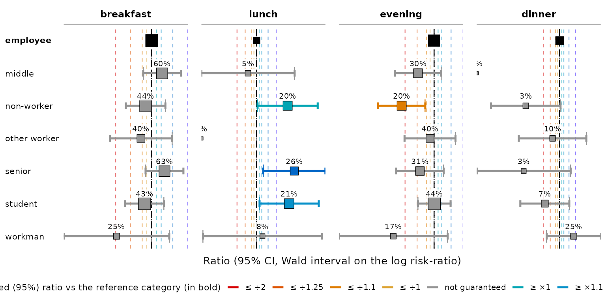

# Introduction to tabxplor: crosstables with tab()

*Une version française de ce document est disponible : [Introduction à
tabxplor](https://bricenocenti.github.io/tabxplor/articles/tabxplor-fr.html).*

The first time only, install the package :

``` r

install.packages("tabxplor", dependencies = TRUE)
```

At the start of each new R session, load it :

``` r

library(tabxplor)
```

`tabxplor` helps you **explore data with cross-tables, coloring the
cells so you can read a table at a glance**. Over-represented cells use
shades of blue, under-represented ones turn red/orange, so patterns jump
out without you squinting at every number.

Everything is a `tibble`, so the result works with the usual `dplyr`
verbs, and tables export to Excel, HTML and Markdown with their color
helpers. Underlying heavy computations run on `data.table`

**No R needed, if you prefer menus.** Everything below is also available
point-and-click, through a module for [jamovi](https://www.jamovi.org/)
— a free, open-source statistical software. Install it, open the modules
menu (the **`+`** at the top right), choose **jamovi library**, and
install *tabxplor*: it adds a **Crosstables** analysis and a
**Regressions** analysis, with the same coloured, exportable tables. The
options carry the same names as the arguments taught here, so this
vignette reads as its manual.

Throughout this vignette we use `gss_simple`, a cleaned-up version of
the US General Social Survey
([`forcats::gss_cat`](https://forcats.tidyverse.org/reference/gss_cat.html))
with factors levels merged and reordered.

``` r

gss_simple <- gss_cat_data_formatting()
```

## Your first cross-tables

[`tab()`](https://bricenocenti.github.io/tabxplor/reference/tab.md)
needs a data frame, a **row variable** and a **column variable**. By
default it shows counts:

``` r

tab(gss_simple, marital, race)
```

|               | race   |       |       |        |
|---------------|--------|-------|-------|--------|
| marital       | White  | Black | Other | Total  |
|               | \<n\>  |       |       | \<n\>  |
| Married       | 8 316  | 869   | 932   | 10 117 |
| Separated     | 437    | 196   | 110   | 743    |
| Divorced      | 2 676  | 495   | 212   | 3 383  |
| Widowed       | 1 475  | 262   | 70    | 1 807  |
| Never married | 3 478  | 1 305 | 633   | 5 416  |
| NA            | 13     | 2     | 2     | 17     |
| Total         | 16 395 | 3 129 | 1 959 | 21 483 |

This is tabxplor’s **html table** — what you get in the RStudio or
Positron Viewer pane with the recommended session option, used
throughout this vignette:

``` r

options(tabxplor.print = "html")
```

Without the option, the same table prints in the **console**, as a
colored `tibble` — same information, lighter display:

``` r

tab(gss_simple, marital, race)
```

``` r-output
#> # A tabxplor tab: 7 × 5
#>   marital        White Black Other  Total
#>                    <n>   <n>   <n>    <n>
#> 1 Married        8 316   869   932 10 117
#> 2 Separated        437   196   110    743
#> 3 Divorced       2 676   495   212  3 383
#> 4 Widowed        1 475   262    70  1 807
#> 5 Never married  3 478 1 305   633  5 416
#> 6 NA                13     2     2     17
#> 7 Total         16 395 3 129 1 959 21 483
```

Add `pct = "row"` for row percentages (or `"col"` for column
percentages). A **Total** row/column and a count column (`n`) are added
automatically:

``` r

tab(gss_simple, marital, race, pct = "row")
```

|               | race     |       |       |               |
|---------------|----------|-------|-------|---------------|
| marital       | White    | Black | Other | Total         |
|               | \<row%\> |       |       | \<row% (n)\>  |
| Married       | 82%      | 9%    | 9%    | 100% (10 117) |
| Separated     | 59%      | 26%   | 15%   | 100% (   743) |
| Divorced      | 79%      | 15%   | 6%    | 100% ( 3 383) |
| Widowed       | 82%      | 14%   | 4%    | 100% ( 1 807) |
| Never married | 64%      | 24%   | 12%   | 100% ( 5 416) |
| NA            | 76%      | 12%   | 12%   | 100% (    17) |
| Total         | 76%      | 15%   | 9%    | 100% (21 483) |

When the column variable is **numeric**,
[`tab()`](https://bricenocenti.github.io/tabxplor/reference/tab.md)
shows its **mean** in each row instead of percentages:

``` r

tab(gss_simple, marital, age)
```

|               | age           |
|---------------|---------------|
| marital       | mean          |
|               | \<mean (cv)\> |
| Married       | 49 (cv 31%)   |
| Separated     | 45 (cv 30%)   |
| Divorced      | 51 (cv 26%)   |
| Widowed       | 72 (cv 18%)   |
| Never married | 34 (cv 40%)   |
| NA            | 52 (cv 32%)   |
| Total         | 47 (cv 37%)   |

You can pass **several row and column variables at once**.

``` r

tab(gss_simple, c(race, relig), c(party3, tvhours), na = "drop_all", pct = "row")
```

[TABLE]

A few other everyday arguments: `na = "drop"` to drop missing values
from the base, `digits =` for the number of decimals, and
`cleannames = TRUE` to strip prefixes like `"1-"` from level names. See
[`?tab`](https://bricenocenti.github.io/tabxplor/reference/tab.md) for
the full list.

**If your numbers are already counted** — a published table, a
[`table()`](https://rdrr.io/r/base/table.html), a
[`count()`](https://dplyr.tidyverse.org/reference/count.html) — start
from
[`tab_counts()`](https://bricenocenti.github.io/tabxplor/reference/tab_counts.md)
instead. It builds the same object, with the same percentages, colours
and tests:

``` r

counts <- dplyr::count(gss_simple, marital, race) # or a published table
tab_counts(counts, marital, race, counts = n, pct = "row", color = "difference")
```

[TABLE]

## Colours: reading a table at a glance

One of the main purposes of `tabxplor` is its palette of colour helpers
for data exploration. `color = "difference"` colors each cell by **how
far it sits from its reference** — by default the Total of its row or
column. Cells clearly above the average turn **blue**, cells clearly
below turn **red/orange** — the further a cell sits from its reference,
the stronger the shade — and a color legend is printed underneath.

``` r

tab(gss_simple, race, party3, pct = "row", color = "difference")
```

[TABLE]

`color = "auto"` picks a sensible scheme automatically for each column
type (difference as text colour *and* ratio as background for
percentages, ratio alone for means, …); the legend says which one:

``` r

tab(gss_simple, rincome, c(party3, marital), pct = "row", color = "auto")
```

[TABLE]

Numeric columns are colored the same way, on their **means** (here,
hours of TV per day by income):

``` r

tab(gss_simple, rincome, tvhours, color = "difference")
```

[TABLE]

**Which cell is the reference for comparison ?** By default each cell is
compared to the relevant Total (Total row for row percentages and Total
column for column percentages) to highlight over-representations and
under-representations. Two useful alternatives:

- `ref = 1` compares each level to the **first one** — perfect for
  reading an evolution over time, or an ordinal factor. Here the
  deviation from the year 2000 is read as a ratio (`color = "ratio"`).
- with sub-tables, `comp = "all"` compares against the **overall** Total
  instead of each sub-table’s own Total.

``` r

tab(gss_simple, relig, year, pct = "col", color = "ratio", ref = 1)
```

[TABLE]

``` r

tab(gss_simple, rincome, party3, race, na = "drop", pct = "row", 
    color = "auto", comp="all")
```

[TABLE]

**A different reference for each variable.** `ref` is reinterpreted by
`pct`. Under **row** percentages (or means) it picks a reference
**row**, so a *named* vector gives each row variable its own — here
`race` is read against its first row, `relig` against its Total:

``` r

tab(gss_simple, c(race, relig), party3, pct = "row", color = "difference",
    ref = c(race = 1, relig = "tot"), na = "drop")
```

[TABLE]

Under **column** percentages `ref` picks a reference **column** instead,
vectorised over the column variables — either named
(`ref = c(party3 = "first", marital = "tot")`) or positional, one value
per column variable:

``` r

tab(gss_simple, race, c(party3, marital), pct = "col", color = "difference",
    ref = c("first", "tot"), na = "drop")
```

[TABLE]

Color thresholds and the palette can be customised : set them **once for
the whole session** with
[`set_color_breaks()`](https://bricenocenti.github.io/tabxplor/reference/set_color_palette.md)
and
[`set_color_palette()`](https://bricenocenti.github.io/tabxplor/reference/set_color_palette.md).

## Colours that respect significance

The colors above show the *size* of a deviation, but not whether it is
**statistically reliable**. On small samples a big-looking difference
can be pure noise. The `color_signif` argument brings significance into
the coloring:

- `"ignore"` (default): color every deviation by its observed size. Grey
  out small differences below a certain threshold.
- `"grey_non_signif"`: color by size of the effect, grey out small
  effects below a certain threshold, but also **grey out cells with
  important effects that are not significant**. Every colored cell is
  then guaranteed to be significantly different from its reference,
  without being bothered by very small significant differences.
- `"guaranteed_effect"`: color only by the part of the effect you can be
  confident about (its confidence bound), with dimmer, conservative
  colors. Use it on **small samples** to **highlight all the differences
  you have the right to interpret**. Everything colored is significant ;
  nothing grey is.

``` r

tab(gss_simple, race, party3, pct = "row", color = "difference", 
    color_signif = "grey_non_signif")
```

[TABLE]

``` r

gss_simple |>
  dplyr::filter(year == "2012") |> # n=1 974
  tab(race, party3, pct = "row", color = "difference", color_signif = "guaranteed_effect")
```

[TABLE]

On **small samples** a big-looking percentage can rest on a handful of
respondents. `n_min =` is a purely visual filter, applied last: it hides
cells whose (unweighted) base is below the threshold and drops a row
entirely when its largest base falls short. Here the rarest religions
drop out:

``` r

tab(gss_simple, relig, race, pct = "row", n_min = 400)
```

|                 | race     |       |       |               |
|-----------------|----------|-------|-------|---------------|
| relig           | White    | Black | Other | Total         |
|                 | \<row%\> |       |       | \<row% (n)\>  |
| Protestant      | 75%      | 21%   | 4%    | 100% (10 846) |
| Catholic        | 78%      | 4%    | 18%   | 100% ( 5 124) |
| Other christian | 72%      | 18%   | 10%   | 100% (   784) |
| None            | 80%      | 11%   | 9%    | 100% ( 3 523) |
| Total           | 76%      | 15%   | 9%    | 100% (21 483) |

An alternative is to keep the small rows and cols but group them all in
a “Other” level :

``` r

tab(gss_simple, relig, race, pct = "row",  other_if_less_than = 400)
```

|                 | race     |       |       |               |
|-----------------|----------|-------|-------|---------------|
| relig           | White    | Black | Other | Total         |
|                 | \<row%\> |       |       | \<row% (n)\>  |
| Protestant      | 75%      | 21%   | 4%    | 100% (10 846) |
| Catholic        | 78%      | 4%    | 18%   | 100% ( 5 124) |
| Other christian | 72%      | 18%   | 10%   | 100% (   784) |
| None            | 80%      | 11%   | 9%    | 100% ( 3 523) |
| Others          | 68%      | 10%   | 22%   | 100% ( 1 098) |
| NA              | 67%      | 18%   | 16%   | 100% (   108) |
| Total           | 76%      | 15%   | 9%    | 100% (21 483) |

## Confidence intervals, tests and stars

Print confidence intervals for the percentage or mean of each cell with
`ci = "cell"` :

``` r

tab(gss_simple, race, party3, pct = "row", ci = "cell") # by default, conf_level = 0.95
```

[TABLE]

Print the confidence intervals of the **difference** with a reference,
used to calculate significance (if 0 belongs to the confidence interval,
the cell is not significantly different from the reference, here the
Total row) :

``` r

gss_simple |>
  dplyr::filter(year == "2012") |> # n=1 974
  tab(race, party3, pct = "row", 
      color = "difference", ref = 1, color_signif = "guaranteed_effect",
      display = "base_ci" # "{base} {ci}"
  )
```

[TABLE]

`display = "base_ci"` is the named layout for this. `{base}` means “the
level this column shows” — a percentage on a factor column, a mean on a
numeric one — so one call works for a mix of factors and numbers, and
each column answers with its own quantity. The next section covers the
rest of the layouts.

`display = "ci"` prints that interval on its own. Add significance stars
with `stars = TRUE`: they tell the same story as the interval of the
deviation from the reference, but at fixed confidence levels (99 %, 95
%, 90 %) :

``` r

gss_simple |>
  dplyr::filter(year == "2012") |> # n=1 974
  tab(rincome, party3, pct = "row", ref = 1, display = "ci", stars = TRUE)
```

[TABLE]

`test = TRUE` adds a statistical test of independence per (sub-)table —
**Chi-squared** for factor columns, **Welch’s F ANOVA** for numeric
variables (`options(tabxplor.anova = "classic")` switches to the pooled
F):

``` r

tab(gss_simple, race, c(party3, tvhours), pct = "row", test = TRUE)
```

[TABLE]

## Batteries of yes/no items, and a score

**Multiple-answer questions** — “which of these apply to you?” — reach
the data as a *battery* of yes/no factors, one per item.
`levels = "first"` keeps only the first level of each column factor, so
a whole battery fits in one compact table, one column per item.

`facto_tea`, which ships with tabxplor (300 tea drinkers, from the
**FactoMineR** package of François Husson, Julie Josse, Sébastien Lê and
Jérémy Mazet — with thanks; see
[`?facto_tea`](https://bricenocenti.github.io/tabxplor/reference/facto_tea.md)),
has such a battery: *when do you drink tea?*, asked as six yes/no items.
Everything below depends on one thing — the “yes” answer has to be each
factor’s **first** level, which is how the shipped copy stores it:

``` r

tea_when_vars <- c("breakfast", "lunch", "tea.time", "evening", "dinner", "always")
# levels(facto_tea$breakfast)   # always check: the "yes" answer must come first
```

[`score_from_lv1()`](https://bricenocenti.github.io/tabxplor/reference/score_from_lv1.md)
reduces that same battery to a single **summed score**: for each person
it counts the factors sitting at their first level — here, at how many
of the six moments they drink tea (missing values never count). The
score is an ordinary numeric variable, so it takes its place in the same
table, as a mean:

``` r

tea <- facto_tea |> score_from_lv1("tea_when", vars_list = tea_when_vars) # score variable
tab(tea, SPC, all_of(c(tea_when_vars, "tea_when")), pct = "row", 
    levels = "first", na = "drop", color = "difference")
```

[TABLE]

Each percentage reads down its own column: 63 % of senior managers drink
tea at breakfast, against 25 % of manual workers. There is no Total
column, and rightly so — the six items do not add up to 100 %, since one
person can tick several. The score plays that role instead: 2.1 moments
a day on average for senior managers, 1.5 for manual workers.

`levels = "auto"` makes that choice **per variable**: it keeps the first
level only of two-level factors, and every level of the others. It is
what you want when a battery of yes/no items sits beside an ordinary
factor — here two tea moments and the social category, in one table:

``` r

tab(tea, sex, c(breakfast, evening, SPC), pct = "row", 
    levels = "auto", na = "drop", tot = "row")
```

|  |  | breakfast | evening | SPC |  |  |  |  |  |  |
|----|----|----|----|----|----|----|----|----|----|----|
| sex | n | breakfast_lv | evening_lv | employee | middle | non-worker | other worker | senior | student | workman |
|  | \<n\> | \<row%\> | \<row%\> | \<row%\> |  |  |  |  |  |  |
| F | 178 | 47% | 33% | 21% | 12% | 24% | 7% | 5% | 29% | 2% |
| M | 122 | 50% | 37% | 17% | 16% | 17% | 7% | 21% | 16% | 7% |
| Total | 300 | 48% | 34% | 20% | 13% | 21% | 7% | 12% | 23% | 4% |

A battery is also what `spread_vars` was made for — see *the most
compact table* below.

A summed score is also exactly what a **grouped-binomial** regression
models — see `trials` in
[`vignette("tabxplor-reg")`](https://bricenocenti.github.io/tabxplor/articles/tabxplor-reg.md).

## Sub-tables, and several row variables

Give [`tab()`](https://bricenocenti.github.io/tabxplor/reference/tab.md)
a third variable as `tab_vars` and it builds **one sub-table per group**
(here, one per income group). The result is *grouped*: `dplyr`
operations then run within each sub-table.

``` r

tab(gss_simple, race, party3, rincome, na = "drop", pct = "row")
```

[TABLE]

When you pass several **row variables** *without* `tab_vars`,
[`tab()`](https://bricenocenti.github.io/tabxplor/reference/tab.md)
merges the mirror tables into a single table by default.
`output_list = TRUE` returns instead a **list with one table per row
variable** (with `tab_vars`, the result is always a list):

``` r

tab(gss_simple, c(married, income25k), race, pct = "row", output_list = TRUE)
```

### The most compact table: one block of columns per group

`spread_vars` shows a sub-table variable **across** the page instead of
down it: each of its levels becomes a *block of columns*. Put it
together with `levels = "first"` (one column per variable, see above)
and you get the most condensed table the package can draw — several
variables, several groups, one screen:

``` r

tab(gss_simple, rincome, c(married, tvhours), tab_vars = race, spread_vars = race,
    pct = "row", na = "drop", levels = "first", comp = "all",
    color = "auto", color_signif = "grey_non_signif")
```

[TABLE]

The layout follows from the shape, and the table says so:

- there is **one `Total` row** for the whole table; each block answers
  in its own columns.
- the base count takes **one `n` column per block**, gathered at the
  right, so the counts can be read against each other. A `Total` column
  per block would only repeat `100%`.
- `comp = "all"` compares every cell against the **overall** total
  rather than its own group’s — here the `Ensemble` block’s `Total`
  cell, the one number every shade in the table is measured from. The
  color legend names it.
- a total *line* cannot become a block of columns, so
  `totaltab = "line"` (the default) is promoted to `"table"`, and the
  message says so. Say `totaltab = "no"` if you want no overall block at
  all.

A variable named in `spread_vars` alone is added to `tab_vars` for you,
so `tab(gss_simple, rincome, party3, spread_vars = race, pct = "row")`
is a complete call.

## Weights

Give `wt =` a weight column and every percentage and mean becomes an
estimate of the *population* rather than of the people you happened to
interview:

``` r

gss_w <- dplyr::mutate(gss_simple, w = ifelse(marital %in% "Never married", 2.5, 0.8))
tab(gss_w, race, party3, wt = w, pct = "row", na = "drop")
```

[TABLE]

That is the easy half. The **margins of error** around those percentages
have three levels, and a table’s footer always says which one it is on:

1.  **weighted percentages, plain margins of error** — the default, and
    the convention almost every textbook uses. Under unequal weights it
    runs a little too narrow.
2.  **`design_effect = TRUE`** — every interval, star, colour threshold
    and test accounts for the unequal weighting, exactly.
3.  **a `survey` design passed as `data`** — everything follows the full
    design: strata, clusters, calibration.

Which one you need, what each costs you, and whether it matters for your
table:
[`vignette("tabxplor-weights")`](https://bricenocenti.github.io/tabxplor/articles/tabxplor-weights.md).

## Exporting tables

A finished table exports with its colors to Excel, HTML or Markdown:

``` r

tabs <- tab(gss_simple, race, party3, pct = "row", color = "difference")
tab_export(tabs) # default : html table (RStudio Viewer, .Rmd/.qmd, etc.)
tab_export(tabs, format = "xl", path = "table") # Excel export 
tab_export(tabs, format = "md", path = "table") # flat markdown file
```

Functions
[`tab_html()`](https://bricenocenti.github.io/tabxplor/reference/tab_html.md),
[`tab_xl()`](https://bricenocenti.github.io/tabxplor/reference/tab_xl.md),
[`tab_md()`](https://bricenocenti.github.io/tabxplor/reference/tab_md.md)
do the same thing.

**Getting a table into Word** goes through Excel, and that is the
recommended route rather than a workaround: the workbook holds the
*real* numbers, not rounded strings, so you can still fix a decimal or a
label there. Then copy the cells and paste them into Word — **from the
desktop app, not the browser version**, which drops the formatting.
Colours, bold and borders all survive.

Two options are worth knowing:

- `theme = "auto"` lets an HTML or Markdown export **follow the reader’s
  light/dark mode** (it flips live). For the console,
  `set_color_palette(theme = "auto")` detects the editor (RStudio,
  Positron, etc.) and picks the matching palette — it is applied
  automatically when the package loads.

``` r

tab_export(tabs, theme = "auto") # HTML that follows the reader's light/dark modes
```

- Since numeric variables can only be passed in columns, some complex
  layout with numeric variables in rows need to transpose the table
  during export using `transpose = TRUE` :

``` r

tab(gss_simple, party3, c(race, tvhours), pct = "row",
    color = "ratio", display = "base", n = "min") |>
  tab_html(transpose = TRUE)
```

[TABLE]

- **One stylesheet for a whole document.** In an `.Rmd`/`.qmd` report,
  [`tab_css()`](https://bricenocenti.github.io/tabxplor/reference/tab_css.md)
  writes the colour CSS once and every later table emits only classes,
  so a single `theme` — including `"auto"`, which follows the reader’s
  light/dark mode — styles every table at once. This very vignette does
  exactly that (with `theme = "light"`):

``` r

options(tabxplor.tab_kable_css = FALSE)
tab_css(theme = "auto")   # emit once, near the top of the document
```

Nothing is written inline on a cell, so any look is overridable with
plain CSS afterwards (column widths, fonts…); see
[`?tab_css`](https://bricenocenti.github.io/tabxplor/reference/tab_css.md)
for the role classes (`.tx-rv`, `.tx-tot`, `.tx-num`).

### Black and white, for publication

Colors are for exploring. For a journal, `theme = "print_ready"` renders
the same reading in black and white. It is not one palette but a
**choice** of one, made from what the table is, so a cross-table and a
regression table each get the treatment that suits them. A cross-table
gets `"print_marks"`, where every cell states its own direction and size
in its own characters — one superscript `⁺` or `⁻` per colour threshold
it crosses, and an underline from the third. Those marks *replace* the
significance stars rather than sitting beside them, and the legend names
the typography instead of the hues. (`"print_minimalistic"`, the
bold/italic/underline palette, is still there by name.)

``` r

tab(gss_simple, race, party3, pct = "row", color = "difference") |>
  tab_html(theme = "print_ready")
```

[TABLE]

This is not merely a taste: converted to lightness, the two directions
of the color palette come out as the *same* shades of grey, so a
grayscale print loses over-vs-under entirely. It works in every export —
[`tab_html()`](https://bricenocenti.github.io/tabxplor/reference/tab_html.md),
[`tab_md()`](https://bricenocenti.github.io/tabxplor/reference/tab_md.md)
and
[`tab_xl()`](https://bricenocenti.github.io/tabxplor/reference/tab_xl.md)
(real bold/italic/underline in the spreadsheet) — and the typography is
written as `<b>`/`<i>`/`<u>` markup as well as CSS, so it also survives
a paste into Word. The marks are cell *text*, so a plain-text copy keeps
them and a screen reader reads them aloud.

One option sets that typographic palette for every export at once:

``` r

options(tabxplor.theme = "print_ready")
```

**You rarely need to ask for it.** Every stylesheet already carries this
palette in an `@media print` block, so a colored html table *prints* —
or saves to PDF from your browser — publication-ready on its own. Set
`options(tabxplor.print_rules = FALSE)` if your printer is a color one
and the colors are the point.

## What the cell shows: the `display` grammar

Every cell already holds far more than the one number it prints — its
count, its percentage, its difference from the reference, its confidence
interval. `display` chooses which of them you see. **Nothing is
recomputed**: a display is picked after the table is built, so changing
it never changes a number.

The quickest route is a **named layout**. The everyday ones:

| `display =` | the cell shows |
|----|----|
| `"base"` | the level alone — the percentage, the mean or the count (the default) |
| `"base_ci"` | the level with its confidence interval, `48.6 [45.1; 52.1]` |
| `"base_moe"` | the level with its margin of error, `48.6 ± 3.5` |
| `"base_diff"` | the level and, in brackets, its difference from the reference |
| `"base_ratio"` | the level and the same comparison as a ratio |
| `"mean_sd"` | a mean and its standard deviation (numeric columns) |
| `"mean_cv"` | a mean and its coefficient of variation — the spread as a percentage of the level, so two columns measured in different units become comparable (the default on numeric columns) |

``` r

tab(gss_simple, race, c(party3, tvhours), pct = "row", display = "base_moe")
```

[TABLE]

**Or write your own**, with a [`{}`](https://rdrr.io/r/base/Paren.html)
template naming the fields you want. `display = "{pct} ({diff})"` prints
each percentage followed by its difference from the reference;
`"{pct} (n={n})"` follows it with the count:

``` r

tab(gss_simple, race, party3, pct = "row", color = "difference", display = "{pct} ({diff})")
```

[TABLE]

Two rules are worth knowing. The **first field outside brackets is the
primary one**: it carries the significance stars, it is what an Excel
export keeps as a real number, and it is the only part the colours
paint. And a field can carry **its own precision**, `{pct:1} ({n:0})`,
which beats the table’s `digits` — useful when an aside would otherwise
be printed to as many decimals as the estimate.

**On a table you have already built**,
[`set_display()`](https://bricenocenti.github.io/tabxplor/reference/fmt_fields.md)
does the same thing:

``` r

tabs <- tab(gss_simple, race, party3, pct = "row")
set_display(tabs, "{pct} (n={n})")
```

[TABLE]

[`?tab`](https://bricenocenti.github.io/tabxplor/reference/tab.md) lists
every field a template can name;
[`vignette("tabxplor-programming")`](https://bricenocenti.github.io/tabxplor/articles/tabxplor-programming.md)
explains the record behind them.

## Which cells make the table interesting? (`color = "contrib"`)

Every colour you have seen so far compares a cell to a **reference** you
chose — the Total row, the first row. `color = "contrib"` asks a
different question, and needs no reference at all: **which cells depart
from what we would expect if the two variables were unrelated?** It is
the natural way to colour a table of raw counts (a count has no
reference), and it is what `color = "auto"` picks for one.

There are two useful ways to answer that question, and `color_signif`
chooses between them.

### 1. “Which cells build *this* association?”

``` r

tab(gss_simple, race, party3, color = "contrib")
```

[TABLE]

``` r

# tab(gss_simple, race, party3, pct = "all", color = "contrib")  # works with pct too
```

Each cell is coloured by its **share of the table’s Chi-squared**,
written as a multiple of the average cell: `×1` means “this cell carries
an average share”, `×5` means “five times the average”. The strong cells
are, literally, the ones that make the table’s association what it is.

This scale is *relative to this table*: it says how the association is
distributed inside it, not how big it is. That is exactly what a
**correspondence analysis** reads, and it is why this is the default
reading — but it also means you cannot compare a `×2` here with a `×2`
in another table.

If you have met **log-linear models** for contingency tables (Goodman’s
tradition, familiar from social mobility research), this colouring is
their descriptive core: the chi-squared *is* the log-linear model of
independence, and each cell’s contribution is its departure from it — so
a `color = "contrib"` table is a heatmap of the association pattern,
read at a glance. For the specialist models built on top of that —
quasi-independence, RC association models, UNIDIFF for comparing
fluidity across groups or cohorts — use the
[logmult](https://cran.r-project.org/package=logmult) package, which
also supports complex survey designs. (Note that “log-linear” in this
sense means models of *cell counts* in a table; it is unrelated to
`tab_reg(family = "poisson")`, which models an individual outcome.)

The share itself can be printed as well as coloured.
`set_display("ctr")` gives each cell’s percentage of the table’s
chi-squared, and the Total row gives the average cell’s share — which is
the `×1` the colours are measured against:

``` r

tab(gss_simple, race, party3, color = "contrib") |> set_display("ctr")
```

[TABLE]

### 2. “Which cells are notably off, on a scale I can compare?”

Add `color_signif = "guaranteed_effect"` and the colour switches to the
**standardized residual** — how many standard errors each cell sits away
from what independence predicts:

``` r

tab(gss_simple, race, party3, color = "contrib", color_signif = "guaranteed_effect") |>
  set_display("resid")
```

[TABLE]

Read it with the rule you may know from SPSS: beyond **±2** a cell is
notable, beyond **±3** strongly so. Positive means over-represented,
negative under-represented. Unlike the share above, ±3 means the same
thing in *every* table, so you can compare two tables — and any cell
that is not significant stays grey.

The middle option, `color_signif = "grey_non_signif"`, keeps the
contribution scale of (1) but greys out cells that are not significant.

**In one line:** use the default to see *where the association lives*,
`guaranteed_effect` to see *which cells are individually notable*.

Either number reads beside the percentages, with a `display` template:

``` r

tab(gss_simple, race, party3, pct = "row", color = "contrib",
    display = "{pct} ({resid})")
```

[TABLE]

Hovering an html table shows both numbers (`ctr:` and `resid:`) in the
tooltip, whatever you display: every tooltip line is named after the
field it shows, so the hover uses the same words as the column headers
and as `$`.

**If you need to cite it**: this is Haberman’s *adjusted standardized
residual* — SPSS’s “adjusted residual”, R’s `chisq.test()$stdres` — not
the `(o − e)/√e` that several tools also call “standardized”, which sits
below a ±2 scale and under-states. As everywhere in tabxplor the test is
per cell, so in a 30-cell table expect one or two false positives at 5 %
(±3 is roughly a Bonferroni correction at that size). See
[`?tab`](https://bricenocenti.github.io/tabxplor/reference/tab.md).

## Hover tooltips (html tables)

Every html table carries per-cell hover **tooltips** with the numbers
behind the cell: the unweighted count, the difference from the
reference, the ratio, the confidence interval… They are on by default in
the Viewer and in reports — this vignette only switched them off
document-wide with `options(tabxplor.tab_kable_tooltips = FALSE)`, to
keep the page light. So you write no argument at all — hover the cells
of the table below, where they are switched back on:

``` r

tab(gss_simple, race, party3, pct = "row", color = "difference")
```

[TABLE]

**A note on weights.** With a weight (`wt =`), every proportion or mean
is weighted, but by default the sample size behind the confidence
intervals and tests stays the real, **unweighted** number of
observations — the footer says so. Under unequal weights that carries no
design effect, so it runs a little too narrow :
`options(tabxplor.design_effect = TRUE)` (see [Weights](#weights))
widens every interval by exactly the weighting’s own design effect and
switches the whole-table Chi2 / F tests to their design-based
counterparts.

## Deviations and their confidence intervals, charted: `forest_plot()`

A colored table already reads at a glance. When the pattern is what
matters,
[`forest_plot()`](https://bricenocenti.github.io/tabxplor/reference/forest_plot.md)
draws the same numbers: one whisker per cell, in the cell’s own colour,
with the percentage or mean printed just above it.

``` r

tab(tea, SPC, c(breakfast, lunch, evening, dinner), pct = "row",
    levels = "first", na = "drop",
    color = "ratio", color_signif = "guaranteed_effect", ref = 1) |>
  forest_plot()
```



The axis is centred on the reference level, here `employee`. What a
point’s position shows is the **deviation** — the comparison your
`color =` grades: a difference from the reference in percentage points,
a ratio or an odds ratio on a log axis. The **level** it sits on is the
number above the whisker, so the two say different things.
`what = "level"` swaps them.

The whisker is the confidence interval, so a level whose whisker crosses
the reference line is not significantly different from it.

Two more things are worth knowing:

- **The gridlines are your colour breaks** — one dashed rule per
  threshold, in that threshold’s own colour, continued beyond the last
  one (each step twice the one before) as far as your data goes. Change
  them with
  [`set_color_breaks()`](https://bricenocenti.github.io/tabxplor/reference/set_color_palette.md)
  and the axis moves with the table.
- **It reads the table, and computes nothing.** It returns a plain
  `ggplot`, so `+ ggplot2::labs(...)`, `+ ggplot2::theme(...)` and
  `ggsave()` work; `theme = "print_ready"` gives the greyscale version,
  `guide = "bands"` shades the panel behind the whiskers with the colour
  scale itself (a good way to *show* a class what the colours mean).

[`forest_plot()`](https://bricenocenti.github.io/tabxplor/reference/forest_plot.md)
draws regression tables too — see
[`vignette("tabxplor-reg")`](https://bricenocenti.github.io/tabxplor/articles/tabxplor-reg.md).

## Working with the result

[`tab()`](https://bricenocenti.github.io/tabxplor/reference/tab.md)
returns a `tibble` (of class `tabxplor_tab`), so `dplyr` verbs just
work. Use the helper
[`is_totrow()`](https://bricenocenti.github.io/tabxplor/reference/fmt_fields.md)
to keep the Total row in place when you re-order (it flags total rows,
so sorting on it first sends them to the bottom):

``` r

library(dplyr)
tab(gss_simple, race, marital, pct = "row") |>
  arrange(desc(Married))
```

|       | marital  |           |          |         |               |     |               |
|-------|----------|-----------|----------|---------|---------------|-----|---------------|
| race  | Married  | Separated | Divorced | Widowed | Never married | NA  | Total         |
|       | \<row%\> |           |          |         |               |     | \<row% (n)\>  |
| White | 51%      | 3%        | 16%      | 9%      | 21%           | 0%  | 100% (16 395) |
| Other | 48%      | 6%        | 11%      | 4%      | 32%           | 0%  | 100% ( 1 959) |
| Black | 28%      | 6%        | 16%      | 8%      | 42%           | 0%  | 100% ( 3 129) |
| Total | 47%      | 3%        | 16%      | 8%      | 25%           | 0%  | 100% (21 483) |

**Titling and annotating.** `subtext =` prints one or more legend lines
under a table (a data source, a note).
[`set_caption()`](https://bricenocenti.github.io/tabxplor/reference/set_caption.md)
gives a table a **title that survives a dplyr pipeline**, and every
exporter uses it as the table title:

``` r

tab(gss_simple, race, marital, pct = "row",
    subtext = c("Population: ", "Source: GSS, 2000-2014")) |>
  set_caption("Custom title")
```

Custom title

[TABLE]

## Global R options

A handful of [`options()`](https://rdrr.io/r/base/options.html) set your
preferred defaults once for the whole session — put them at the top of a
script, or in your `.Rprofile`. Each one has a per-call argument too;
the option just changes the default. The everyday ones:

- `options(tabxplor.print = "html")` — print tables not in console, but
  as html in RStudio or Positron Viewer Pane by default (recommended)
- `options(tabxplor.cleannames = TRUE)` — strip `"1-"`-style prefixes
  from level names everywhere.
- `options(tabxplor.parallel = 8)` — parallelise tables with multiples
  variables on different CPU cores by default (needs `mirai`)
- `options(tabxplor.var_labels = TRUE)` — in exports, show a variable’s
  label (from `haven`/`labelled` data) instead of its bare name.
- `options(tabxplor.theme = "auto")` — the export theme
  (`"light"`/`"dark"`/`"auto"`); `set_color_palette(theme = "auto")`
  does the same for the console.
- `options(tabxplor.stars = TRUE)` — show significance stars in every
  table (like `stars = TRUE`).
- `options(tabxplor.conf_level = 0.9)` — the confidence level for
  intervals and tests (default `0.95`).
- `options(tabxplor.design_effect = TRUE)` — on weighted data, make
  every interval, star, colour threshold and test account for the
  unequal weighting (see
  [`vignette("tabxplor-weights")`](https://bricenocenti.github.io/tabxplor/articles/tabxplor-weights.md)).
- `options(tabxplor.lang = "fr")` — the language of the colour legends
  and footers (`"auto"`/`"en"`/`"fr"`).

Colour thresholds and palettes have their own helpers,
[`set_color_breaks()`](https://bricenocenti.github.io/tabxplor/reference/set_color_palette.md)
and
[`set_color_palette()`](https://bricenocenti.github.io/tabxplor/reference/set_color_palette.md).
`?tabxplor-options` documents every option, and
[`vignette("tabxplor-programming")`](https://bricenocenti.github.io/tabxplor/articles/tabxplor-programming.md)
covers the more advanced ones (export fonts, parallel builds…).

## Where to go next

- [`vignette("tabxplor-reading-a-regression")`](https://bricenocenti.github.io/tabxplor/articles/tabxplor-reading-a-regression.md)
  — regressions, taught the way this vignette teaches cross-tables: one
  analysis walked from a first table to a finished sentence.
- [`vignette("tabxplor-reg")`](https://bricenocenti.github.io/tabxplor/articles/tabxplor-reg.md)
  — the regression reference: every family, every argument, the model
  checks and the plots.
- [`vignette("tabxplor-weights")`](https://bricenocenti.github.io/tabxplor/articles/tabxplor-weights.md)
  — weighted and survey data, for both producers.
- [`vignette("tabxplor-programming")`](https://bricenocenti.github.io/tabxplor/articles/tabxplor-programming.md)
  — the `tabxplor_fmt` cell type and how to program with its fields.
- [`?tab`](https://bricenocenti.github.io/tabxplor/reference/tab.md) for
  every argument (grouped by purpose, including the confidence-interval
  methods) and `?tabxplor-options` for the package-wide defaults.
